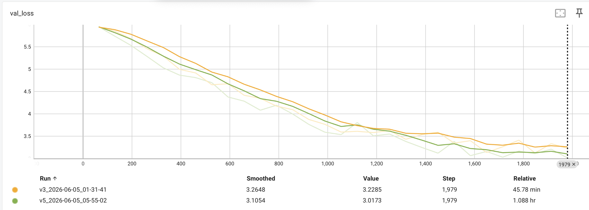

# BERT Pre-Training Modular

Implementación desde cero de la arquitectura BERT utilizando PyTorch y PyTorch Lightning, con RoPE (Rotary Position Embeddings) y MLM dinámico.

## Inicialización rápida con uv

1. Instala el proyecto y sus dependencias:
   `uv sync`
2. Ejecuta el entrenamiento:
   `uv run main.py`

## Unit Tests

3. uv run python -m unittest tests/test_architecture.py